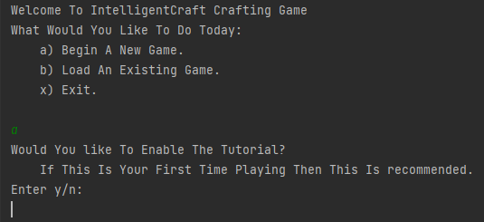
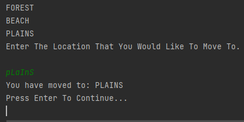
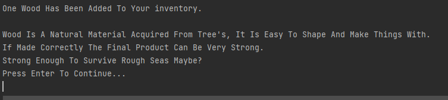

# IntelligentCraft Crafting Game

Team: AJEN\
SID: 2220578

IntelligentCraft Crafting Game is a simple crafting game designed for children where the goal is to progress though each
level by gathering various resources, crafting new items and eventually crafting a mode of transportation that will be
by the player to travel to the next level.

## Usage

As this game is catered towards children an optional tutorial is provided when a new game is created. \
Learning opportunities are also provided to the player when they harvest of craft an item for the first time,
educational information on the item is given and also hints to its future uses to inspire the players' creativity.

### Interacting With The Game

\
All player interactions are handled though the Command line Interface (CLI) as shown above.\
\
Most player inputs require just a single character to keep the interaction simple however some inputs require a string
to be entered. These inputs are not case-sensitive making them easier for the player to interact with and hence provide
a more user-friendly experience.\
\
Here is an example of some feedback given to the player when they acquire a new item.

## Requirements

[Java 8](https://www.java.com/en/download/) or newer is required to run the .jar from the command line though

```
java -jar <file_path>\Assignment011.jar
```

alternatively [JDK-19](https://www.oracle.com/uk/java/technologies/downloads/) or greater is required to compile and run
the src from a suitable IDE\
The entry point is in [GameLauncher.java](GameLauncher.java)

## Licence

[MIT](https://choosealicense.com/licenses/mit/)

## Acknowledgment

Credit for the idea of the game goes to team AJEN during the 010 Assignment

## Table Of Contents

<!-- TOC -->
* [IntelligentCraft Crafting Game](#intelligentcraft-crafting-game)
  * [Usage](#usage)
    * [Interacting With The Game](#interacting-with-the-game)
  * [Requirements](#requirements)
  * [Licence](#licence)
  * [Acknowledgment](#acknowledgment)
  * [Table Of Contents](#table-of-contents)
<!-- TOC -->